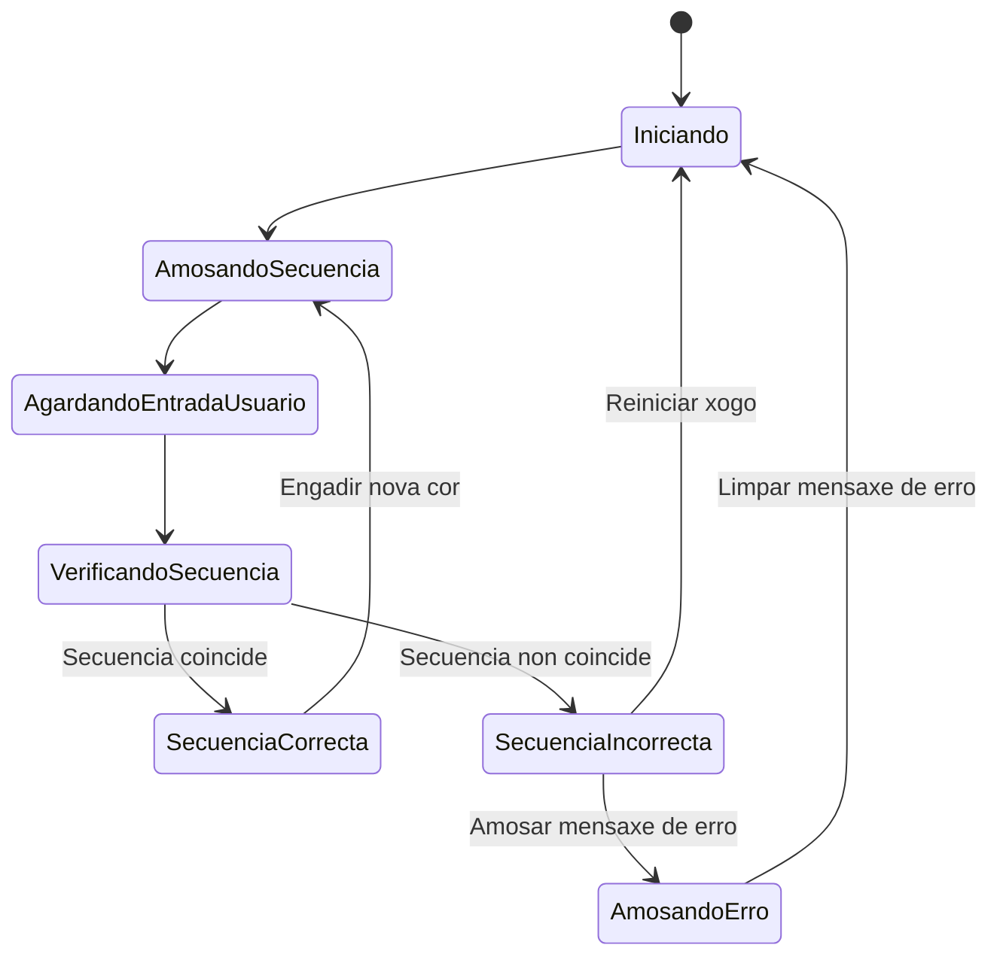
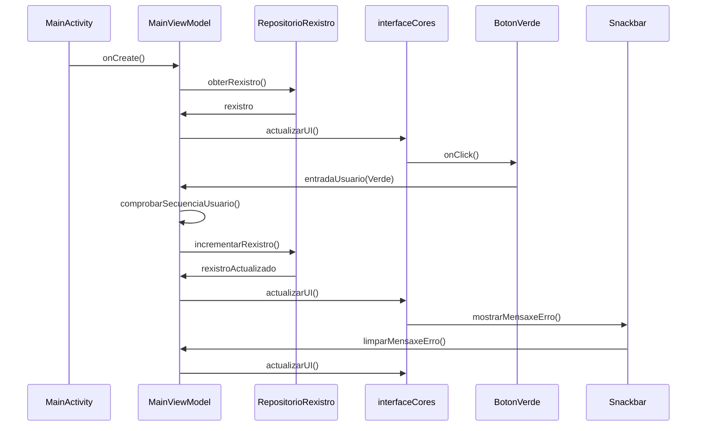

# Aplicación Simon Dice
###### *Debido a executar o comando  `git push origin main --force` para subir o proxecto a GitHub, o historial de commits orixinal foi eliminado. (non sabia que podía pasar isto)*

## 📝 Descrición do Proxecto

A aplicación baséase no patrón MVVM para xestionar de xeito eficiente a lóxica e os datos da UI. Emprega **corutinas** para realizar operacións asíncronas, garantindo unha experiencia fluída para o usuario. Este proxecto non só é unha proba de memoria visual e auditiva, senón tamén un exemplo práctico do uso de tecnoloxías modernas en Android.

## 🔧 Estrutura da Aplicación

### 1. **MainActivity**
- **Rol**: É a actividade principal, o punto de entrada da aplicación.
- **Método principal**:
  - `onCreate(savedInstanceState: Bundle?)`: Configura a UI chamando a `interfazColores`, o compoñente que renderiza a interface principal.

### 2. **MainViewModel**
- **Rol**: Controla a lóxica do xogo e o estado da interface, sincronizándose co ciclo de vida da actividade.
- **Funcións clave**:
  - `startNewGame()`: Inicializa un novo xogo e limpa a secuencia previa.
  - `addColorToSequence()`: Engade unha nova cor á secuencia actual.
  - `showSequence()`: Mostra a secuencia xerada ata o momento.
  - `userInput(color: Color)`: Recolle e valida as entradas do usuario.
  - `checkUserSequence()`: Comproba se o usuario replicou correctamente a secuencia mostrada.

### 3. **MainViewModelFactory**
- **Rol**: Creador de instancias do `MainViewModel`.
- **Método clave**:
  - `create(modelClass: Class<T>): T`: Devolve unha instancia do ViewModel, asegurando a reutilización de datos na aplicación.

### 4. **IU.kt (Interface de Usuario)**
- **Rol**: Define e constrúe a interface do usuario utilizando Jetpack Compose.
- **Componentes clave**:
  - `interfazColores(viewModel: MainViewModel, modifier: Modifier)`: Mostra o récord actual e os botóns de xogo.
  - `Botones(viewModel: MainViewModel, currentColor: Color?)`: Organiza os botóns de cores nunha cuadrícula.
  - **Botóns individuais**:
    - `BotonVerde()`, `BotonRosa()`, `BotonAzul()`, `BotonNaranja()`: Representan os botóns interactivos para as cores. Detectan as pulsacións do usuario e ilumínanse para indicar a cor activa.

### 5. **Datos.kt**
- **Rol**: Define os datos e as clases de estado necesarias para a aplicación.
- **Clases clave**:
  - `Color`: Enumeración de cores posibles.
  - `EstadoJuego`: Enumeración de estados posibles do xogo.
  - `SimonDiceGame`: Clase que xestiona o estado do xogo, gardando a secuencia de cores e o récord actual.

## 🎯 Obxectivo do Proxecto

Este proxecto busca demostrar como se pode crear unha aplicación lúdica utilizando ferramentas modernas de Android como **Jetpack Compose**, **corutinas** e o patrón **MVVM**. 

---

## ✨ Diagrama de Estado

## 💫 Diagrama de Secuencia
