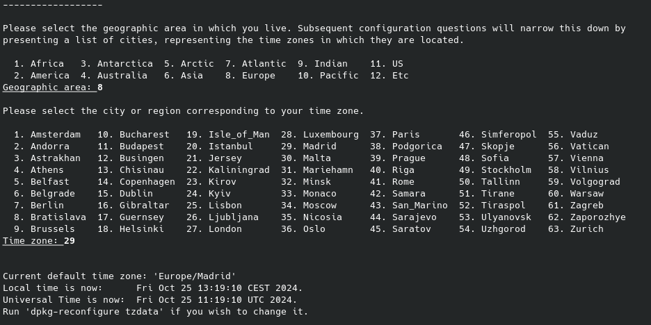

# Tarea 4

---
### **Apartado 1**
#### ***Utiliza la imagen de Ubuntu , tag 22 y apoyandote en esta guía sigue sus instrucciones para instalar LAMP en dicho contenedor.***

`sudo docker run -it ubuntu:22.04`

`apt update` # Actualiza la lista de paquetes


#### ***Crea un contenedor con la imagen de Ubuntu 22.04 y ejecuta el comando tail -f /dev/null para mantenerlo en ejecución.***

`sudo docker run -d --name ubuntu1 ubuntu:22.04 tail -f /dev/null` 

`sudo docker ps` # Para verificar que el contenedor está activo

`docker exec -it cnt_ubuntu sh` # Para ingresar al contenedor

#### Una vez dentro vamos a instalar LAMP en el contenedor

`apt update` # Actualiza la lista de paquetes

`apt install -y apache2 apache2-utils` # Instala Apache

` apt install -y mariadb-server mariadb-client` # Instala MariaDB


` service apache2 start` # Inicia el servicio de Apache


`  apt install -y php php-mysql libapache2-mod-php` # Instala PHP

---
**Configuración de MariaDB**

*Primero, se nos pedirá la contraseña de root, que dejaremos en blanco. Después, nos solicitará cambiarla; la cambiamos y seleccionamos "Y" en cada opción para completar la configuración restante.*

``` bash
service mariadb start
mysql_secure_installation
 ```

---


---
### **Apartado 2**

#### ***Instalar Wordpress en el contenedor de Ubuntu 22.04***

Instalar dependencias de Wordpress
``` bash
apt install ghostscript \
            php-bcmath \
            php-curl \
            php-imagick \
            php-intl \
            php-json \
            php-mbstring \
            php-mysql \
            php-xml \
            php-zip
```

Crear carpeta para Wordpress
``` bash
mkdir /var/www/html/wordpress
```

Descargar Wordpress y descomprimirlo en una carpeta llamada `wordpress`
``` bash
wget https://wordpress.org/latest.tar.gz
```
*POSIBLE ERROR*
``` bash
wget https://wordpress.org/latest.tar.gz
sh: 29: wget: not found
```
Para solucionar este error, instalar `wget`
`apt install wget`

``` bash
tar -xvf latest.tar.gz
mv wordpress /var/www/html/
```

### **Apartado 3**

Comprobar que puedes acceder a wordpress desde el navegador

`http://dirección_IP_del_contenedor`


