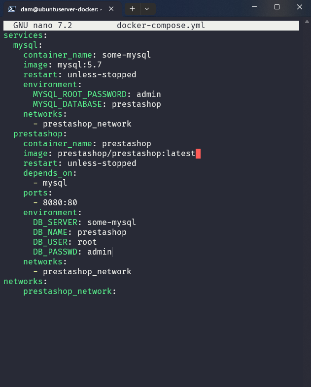
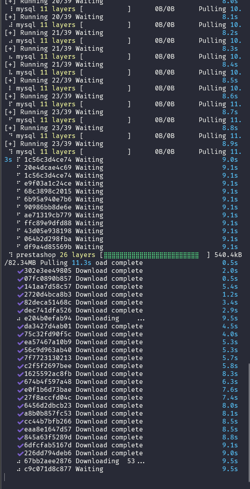
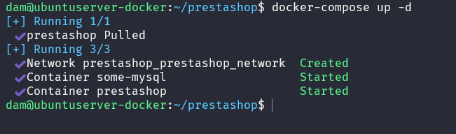
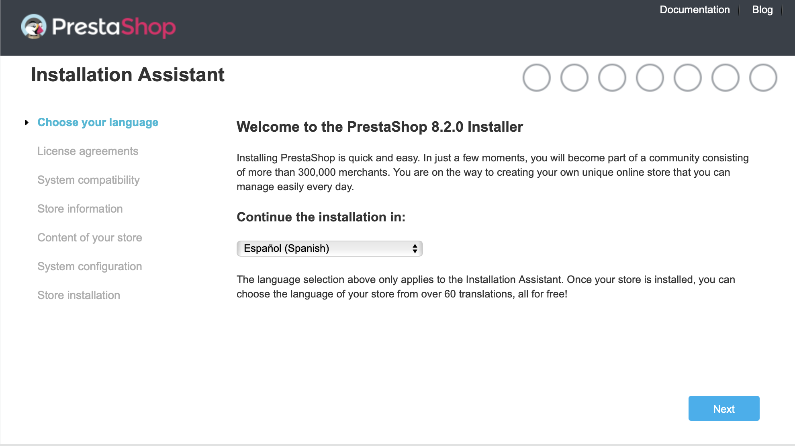

# Tarea 06
##### Anxo Fernandez Rodriguez - DAM 2

## <u>Utiliza docker para poner en marcha Prestashop</u>

- Primero crearemos una carpeta donde instalar Prestashop y nos moveremos a ella.
```bash
mkdir prestashop 
cd prestashop
```
- Para posteriormente crear un archvo docker-compose.yml con el siguiente contenido:
```bash
touch docker-compose.yml
nano docker-compose.yml
```
Pegaremos:
```yaml
services:
  mysql:
    container_name: some-mysql
    image: mysql:5.7
    restart: unless-stopped
    environment:
      MYSQL_ROOT_PASSWORD: admin
      MYSQL_DATABASE: prestashop
    networks:
      - prestashop_network
  prestashop:
    container_name: prestashop
    image: prestashop/prestashop:latest 
    restart: unless-stopped
    depends_on:
      - mysql
    ports:
      - 8080:80
    environment:
      DB_SERVER: some-mysql
      DB_NAME: prestashop
      DB_USER: root
      DB_PASSWD: admin
    networks:
      - prestashop_network
networks:
    prestashop_network:
```



Finalmente ejecutamos el contenedor con el siguiente comando:
```bash
docker-compose up -d
```



---



### <u>Accederemos a la dirección http://localhost:8080/ y comprobamos que se ha instalado todo correctamente</u>
##### ***Paso 1 - Seleccionamos el idioma***


##### ***Paso 2 - Aceptamos los términos***
##### ***Paso 3 - Rellenaremos todos los campos segun la información que se nos pide***


### Ya estaria todo listo para empezar a trabajar con Prestashop!!!
