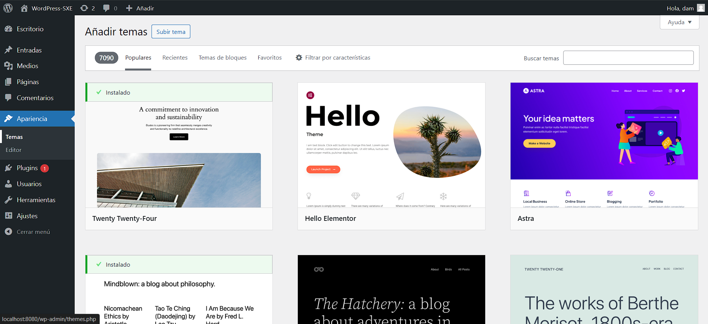

# Tarefa 08
###### Anxo Fernández Rodríguez
### *Entramos en wordpress e accedemos á pestaña de inicio*

  
  

---

### *Configurar tema en wordpress*
1. Ingresar á páxina de wordpress.
2. Ingresar á sección de aparencia.
3. Seleccionar a opción de temas.
4. Seleccionar o tema que se desexa instalar.
5. Dar click en instalar.
6. Dar click en activar.

  
  

---
### *Crear usuarios en wordpress*
1. Ingresar á páxina de wordpress.
2. Ingresar á sección de usuarios.
3. Seleccionar a opción de engadir novo.
4. Ingresar os datos do usuario.
5. Damos os roles que desexamos que teña o usuario.
6. Dar click en engadir novo usuario.

  
  

---

### *Comparativa de temas clásicos e temas de Bloques*
| Característica         | Temas de Bloques                                                                        | Temas Clásicos                                      |
|------------------------|-----------------------------------------------------------------------------------------|-----------------------------------------------------|
| Deseño                 | Usan un deseño baseado en bloques, o que significa que o contido se crea usando bloques | Usan un deseño tradicional                          |
| Flexibilidade          | Ofrecen maior flexibilidade                                                             | Menos flexibles                                     |
| Edición de Partes de Páxina | Poden editar partes da páxina como encabezados e pés de páxina                          | Capacidade limitada para editar partes da páxina    |
| Arquivos de Plantilla  | Almacenan arquivos de plantilla en diferentes ubicacións                                | Almacenan arquivos de plantilla nunha soa ubicación |
| Tecnoloxía             | Básanse en HTML                                                                         | Básanse en PHP                                      |
| Seguridade             | Máis seguros que os temas clásicos basados en plantillas PHP                            | Poden ser menos seguros                             |
| Controis               | Poden ser máis difíciles de usar                                             | A miúdo teñen controis fáciles de usar              |
| Velocidade de Carga    | Poden cargar máis rápido que os temas clásicos                                          | Poden cargar máis lento que os temas de bloques     |

#### *Perspectiva sobre a evolución dos temas:*
- Baixo o meu punto de vista os temas de bloques son mellores que os temas clásicos, xa que ofrecen maior flexibilidade e seguridade, ademais de que son máis rápidos na carga da páxina.

#### *O impacto dos roles no fluxo de traballo:*
- Os roles en wordpress son moi importantes xa que permiten asignar permisos aos usuarios, desta maneira pódese controlar o acceso á información xusta para desempeñar o seu traballo.

FONTES:
- https://nexterwp.com/blog/wordpress-fse-block-themes-vs-classic-themes/
- https://wordpress.org/documentation/